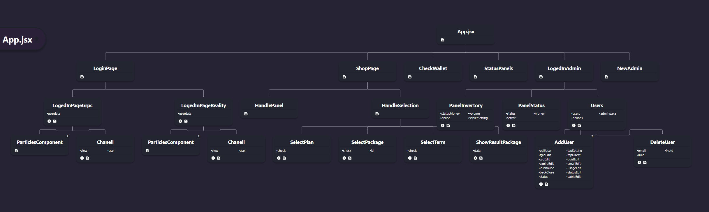

# PAXA_XUI Front-End source code
This source code is for the front-end part of the site, which was developed and completed with ReactJs.
If you did not read the main part of the source code, go to the [MainDoc](https://github.com/hossein-rg) section to learn about the code ..

### Developed by React


### Go to the main section to learn about the code
 - [The main path of the project](https://github.com/hossein-rg)

### Schematic of the site



## Run Locally

Clone the project

```bash
  git clone https://github.com/hossein-rg/FrontEndPaxa
```

Go to the project directory

```bash
  cd FrontEndPaxa
```

Install dependencies

```bash
  npm install or npm install --force
```

Start the server

```bash
  npm run dev
```

### Tip 1
Go to the env file and if you want to run it locally on your system, change it to http://localhost:8001, because the code written with Node.js is running on port 8001.

If you want to run it on the server, change it to the server's IP address or domain name

### Tip 2
To activate the payment gateway in the store section, you need to find an intermediary that allows customers to make payments in the local currency and have it deposited into your account as digital currency. In this code, the store section is inactive and requires an intermediary.

